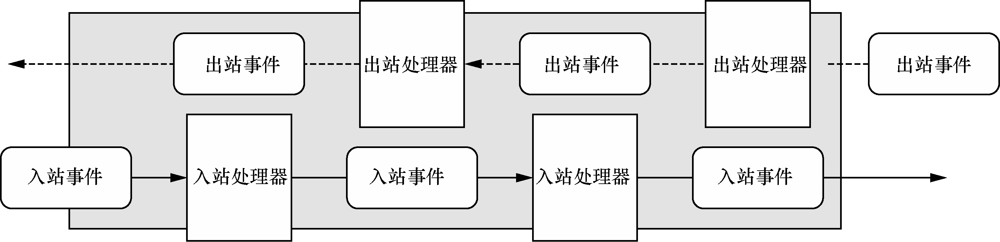

Reactor 线程模型运行机制的四个步骤

- 连接注册：Channel 建立后，注册至 Reactor 线程中的 Selector 选择器；

- 事件轮询：轮询 Selector 选择器中已注册的所有 Channel 的 IO 事件；

- 事件分发：为准备就绪的 IO 事件分配相应的处理线程；

- 任务处理：Reactor 线程还负责任务队列中非 IO 任务，每个 worker 线程从各自维护的任务队列中取出任务异步执行。

Inbound 事件和 Outbound 事件的传播方向是**不一样**的。Inbound 事件的传播方向为 `Head -> Tail`，而 Outbound 事件传播方向是 `Tail -> Head`，两者恰恰相反。在 Netty 应用编程中一定要理清楚事件传播的顺序。推荐你在系统设计时模拟客户端和服务端的场景画出 ChannelPipeline 的内部结构图，以避免搞混调用关系。

- ChannelPipeline 是双向链表结构，包含 ChannelInboundHandler 和 ChannelOutboundHandler 两种处理器。

- ChannelHandlerContext 是对 ChannelHandler 的封装，每个 ChannelHandler 都对应一个 ChannelHandlerContext，实际上 ChannelPipeline 维护的是与 ChannelHandlerContext 的关系。

- Inbound 事件和 Outbound 事件的传播方向相反，Inbound 事件的传播方向为 Head -> Tail，而 Outbound 事件传播方向是 Tail -> Head。

- 异常事件的处理顺序与 ChannelHandler 的添加顺序相同，会依次向后传播，与 Inbound 事件和 Outbound 事件无关。

